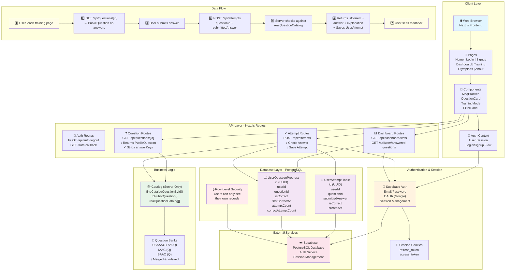

# Astro Coach System Architecture

## Architecture Diagram

---

## Four-Layer Architecture

### 1. **Client Layer**
- **Next.js App Router** with React components and TypeScript
- **Pages**: Home, Login, Signup, Dashboard, Training, Olympiads, About
- **Components**: McqPractice, QuestionCard, TrainingMode, FilterPanel, QuestionAnsweredIndicator
- **Auth Context**: Manages user session, sign-up/sign-in flow, logout
- **State Management**: React hooks (useState, useContext, useEffect)

### 2. **API Layer** (Serverless Functions)
- **Auth Routes**
  - `POST /api/auth/logout` — Signs out user via Supabase
  - `GET /auth/callback` — OAuth callback for Google login
- **Question Routes**
  - `GET /api/questions/[id]` — Returns PublicQuestion (strips answer keys)
- **Attempt Routes**
  - `POST /api/attempts` — Checks answer, saves attempt, updates progress
- **Dashboard Routes**
  - `GET /api/dashboard/stats` — Returns user stats (accuracy, attempts, recent attempts)
  - `GET /api/user/answered-questions` — Returns list of question IDs user has attempted

### 3. **Business Logic** (Server-Only)
- **Question Catalog** (`src/data/mcq/catalog.server.ts`)
  - In-memory array combining three question banks (USAAAO, IAAC, BAAO)
  - ~726+ questions with stable deterministic IDs
  - Functions: `findCatalogQuestionById()`, `toPublicQuestion()` (strips answers)
  - Throws error if accidentally imported in browser
- **Type System**
  - `CatalogQuestion` — Full question with answers (server-only)
  - `PublicQuestion` — Question without answers (safe for browser)

### 4. **Persistence Layer** (Supabase PostgreSQL)
- **Tables**
  - `UserAttempt` — One row per answer-checking attempt
    - Tracks: userId, questionId, submittedAnswer, isCorrect, timestamp
  - `UserQuestionProgress` — One row per (user, question) pair
    - Tracks: userId, questionId, isCorrect, firstCorrectAt, attemptCount, correctAttemptCount
    - Powers the "35 / 40 unique correct" score
- **Authentication** — Supabase Auth handles email/password and OAuth
- **Session Management** — Cookies with access/refresh tokens
- **Row-Level Security** — Policies ensure users only see their own records

---

## Data Flows

### Question Viewing Flow
1. User navigates to training page or question list
2. Browser calls `GET /api/questions/[id]`
3. Server looks up question in `realQuestionCatalog`
4. `toPublicQuestion()` strips `correctAnswer`, `explanation`, `solutionMedia`
5. Browser receives PublicQuestion with just question text and choices
6. UI displays question without spoilers

### Answer Checking Flow
1. User selects a choice and clicks "Check Answer"
2. Browser sends `POST /api/attempts` with `questionId` + `submittedAnswer`
3. Server looks up question in `realQuestionCatalog`
4. Server compares `submittedAnswer` === `question.correctAnswer`
5. If authenticated (Bearer token), save `UserAttempt` row and upsert `UserQuestionProgress`
6. Server returns `{ isCorrect, correctAnswer, explanation, solutionMediaMissing, saved }`
7. Browser displays feedback (answer, explanation, correct/incorrect)

### Progress Tracking Flow
1. Every answer submission updates two tables:
   - `UserAttempt` — Raw record of each submission
   - `UserQuestionProgress` — Aggregate per (user, question), tracking first correct, attempt count
2. Dashboard queries `UserQuestionProgress` to calculate:
   - Total unique questions attempted
   - Unique questions answered correctly
   - Accuracy percentage
3. Training mode queries answered questions list to highlight already-solved problems

### Authentication Flow
1. User signs up with email + password (or OAuth redirect)
2. Supabase Auth creates a user account
3. Session stored in secure cookie (access_token + refresh_token)
4. Middleware (`src/proxy.ts`) refreshes session on every request
5. API routes verify Bearer token and extract `user.id` via `supabase.auth.getUser(token)`
6. Logout clears session cookie

---

## Security Boundaries

### ✅ Protected
- 🔒 **Answer keys never in static exports** — `realQuestionCatalog` is server-only; browser never receives answers without submission
- 🔒 **User isolation** — RLS policies + server-side userId verification prevents cross-user data access
- 🔒 **Authentication required for progress tracking** — Only logged-in users can save attempts
- 🔒 **Generic API error messages** — No Prisma/database details leaked to client

### ⚠️ By Design
- ⚠️ **Answer keys returned on submission** — Intentional for learner feedback, including logged-out users
- ⚠️ **Question IDs are deterministic** — Derived from competition/year/exam/number; not secrets
- ⚠️ **No rate limiting** — Prototype; would need for production
- ⚠️ **No CSRF tokens** — POST endpoints are safe (don't modify user data except recording attempts)

---

## Technology Stack

| Layer | Technology |
|-------|-----------|
| **Frontend** | Next.js 16, React 19, TypeScript, Tailwind CSS, shadcn/ui |
| **API** | Next.js App Router (serverless functions) |
| **ORM** | Prisma 7 with PrismaPg adapter |
| **Database** | Supabase (PostgreSQL) |
| **Auth** | Supabase Auth (email/password, OAuth) |
| **Session** | Secure HTTP-only cookies |
| **Hosting** | Vercel (for deployment) |

---

## Deployment Checklist

- [ ] Verify Prisma Client generation: `npm run postinstall`
- [ ] Set `DATABASE_URL` (pooled connection) in Vercel env
- [ ] Set `DIRECT_URL` (direct connection) in Vercel env for migrations
- [ ] Set `NEXT_PUBLIC_SUPABASE_URL` in Vercel env
- [ ] Set `NEXT_PUBLIC_SUPABASE_ANON_KEY` in Vercel env
- [ ] Verify Supabase RLS policies on `UserAttempt` and `UserQuestionProgress`
- [ ] Confirm OAuth redirect URL in Supabase dashboard
- [ ] Run `npm run build` locally to verify build succeeds
- [ ] Test answer checking flow end-to-end on preview deployment
